# ToDoList App – DevOps Project
This repository contains all the necessary files and configurations to automate the deployment of a Node.Js application using DevOps tools **Docker**, **GitHub Actions**, **Vmware Workstation**, **Ansibe**, **Kubernetes** and **GitOps with ArgoCD**.


## Project Overview
The project is divided into four parts. Below is a breakdown of each part and how I tackled it.


## Part 1: CI Pipeline with GitHub Actions
- **Repo cloned from:** [Todo-List-nodejs](https://github.com/Ankit6098/Todo-List-nodejs) (Minor updates were made to the application files to address issues encountered during deployment. All changes are reflected in this repository).
- **Database:** Used a MongoDB container during local development using (mongo:latest) image from Docker Hub, later replaced with a MongoDB deployment via Kubernetes manifests for production. Configurations handled through .env
- **Dockerized** the application with a production-ready `Dockerfile`
- **CI Pipeline:** Implemented with GitHub Actions to automate the image build and push process:
  - Builds the Docker image on each push to the main branch
  - Builds the Docker image
  - Pushes to a **private Docker Hub registry**
###  Tools Used:
- Docker
- GitHub Actions
- DockerHub (private repo)
### Notes
  - Docker Hub credentials are securely managed using GitHub Actions Secrets
#### Successful Pipeline Triggering:
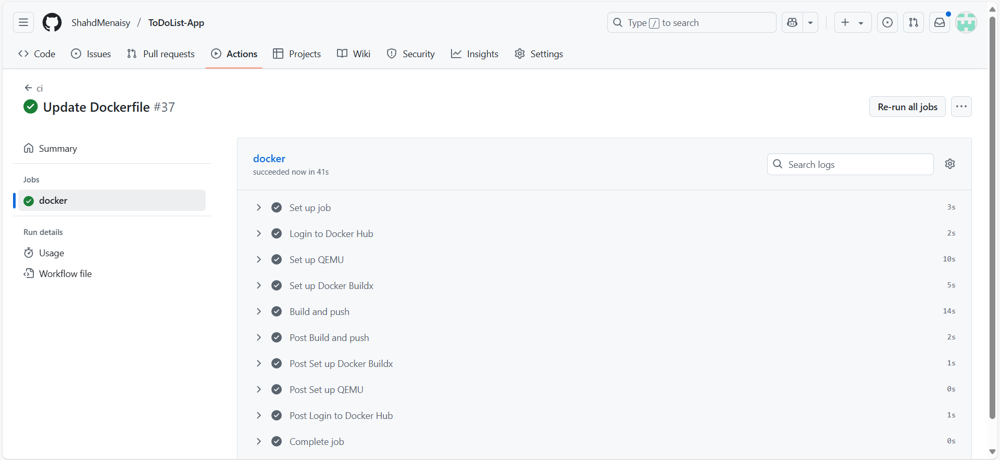
#### Successful Image Push:
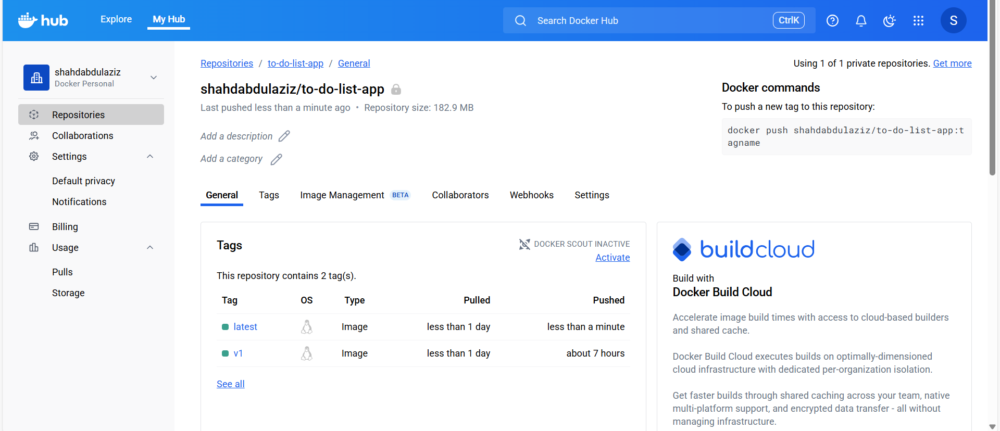
    
## Part 2: Infrastructure Provisioning with Ansible

- Provisioned a **Linux VM** (Ubuntu 24.04.1) on **[VMware]**
- **Provisioning**: Configured the VM using **Ansible**:
  - Installed Docker & Minikube
  - Set up a minikube cluster
### Notes
  -  Ansible was executed from my local Windows machine using WSL (Windows Subsystem for Linux) for compatibility and ease of SSH-based provisioning.
### Tools Used:
  - VMware Workstation 
  - Ansible
#### Successful Output of The Ansible Playbook Run:
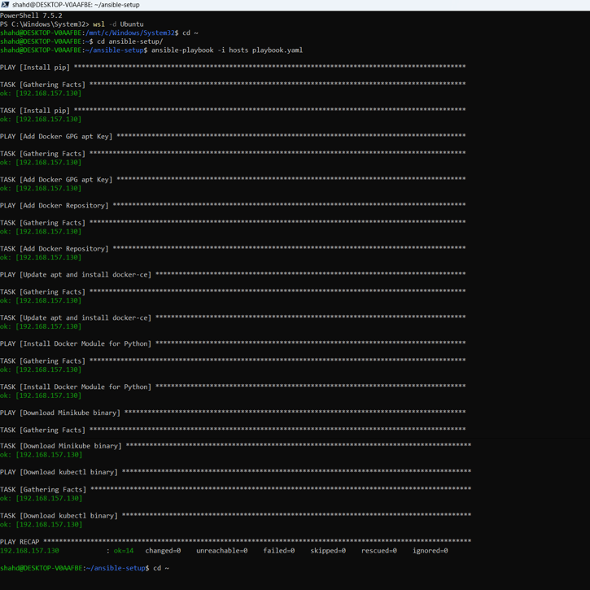
#### Successful VM Configuration:
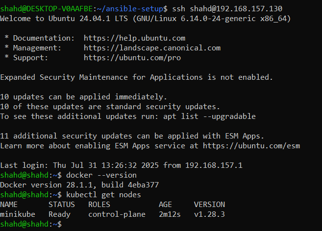

## Part 3: Deployment and Image Auto-Update

- **Deployment**: Used Kubernetes to run the app on the VM
- Created Kubernetes manifest files and Configured **health checks** in deployments manifest files.
- **CD (image auto-update)** using used ArgoCD:
  - Created an Application.yaml to define the sync behavior.
  - Configured ArgoCD with: The GitHub repository as the source and The Kubernetes cluster as the destination.
  - Enabled automated sync using:
  ```yaml
  automated:
    selfHeal: true       
    prune: true
  ```       

As a result, any change to Kubernetes manifests in the repo is automatically applied to the cluster by ArgoCD.
    
### Tools Used:
- Kubernetes
- ArgoCD
### Notes:
- Picked Kubernetes for orchestrating containers, deployed directly on a single-node VM.
- Chose **ArgoCD** over other CD tools for its declarative GitOps model.
- The application image is hosted on a private Docker Hub repository. To enable Kubernetes to pull the image:
    - Created an image pull secret:
```bash
kubectl create secret docker-registry <secret-name> \
  --docker-server=<your-registry-server> \
  --docker-username=<your-user-name> \
  --docker-password=<your-pword> \
  --docker-email=<your-email>\
  -n <namespcae-name>
```
    - Inspecting the Secret
```bash
kubectl get secret <secret-name> --output=yaml -n <namespcae-name>
```
#### Kubernetes Resources Deployed By ArgoCD
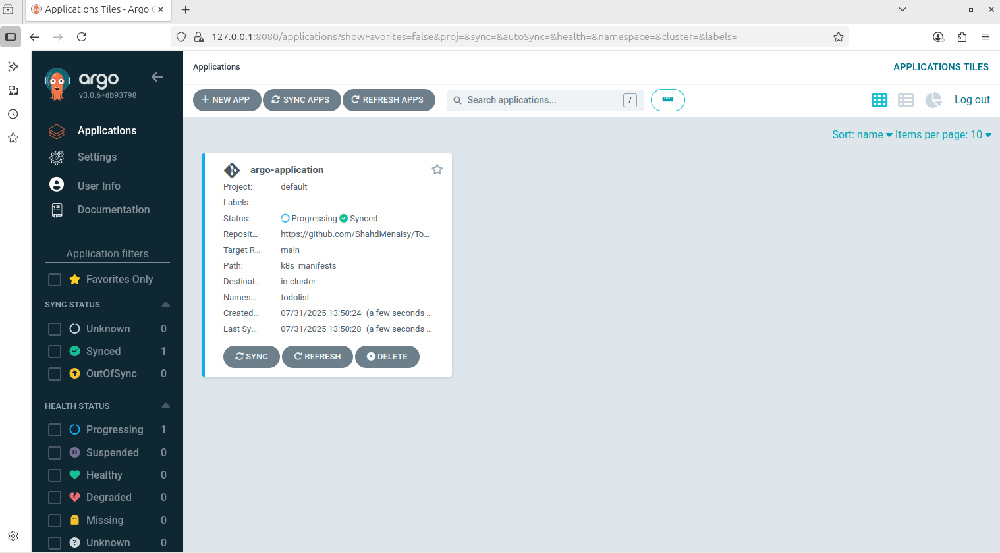
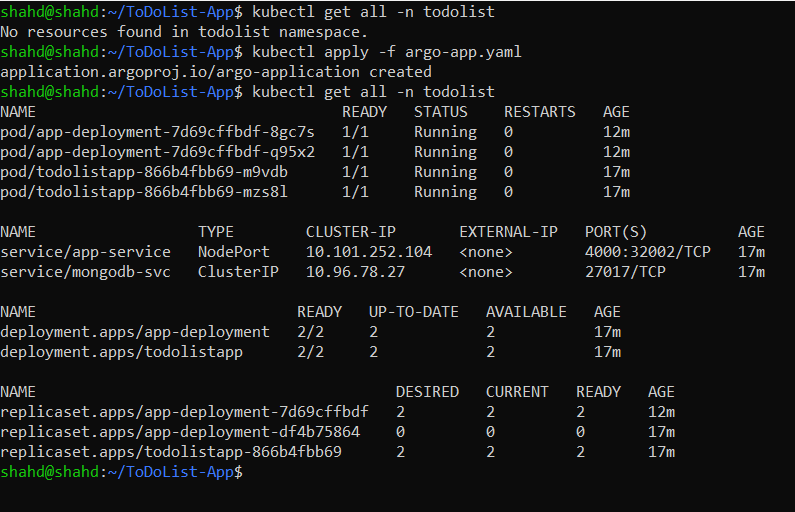
#### Example On ArgoCD Always Pulling The Image
notice the image here 
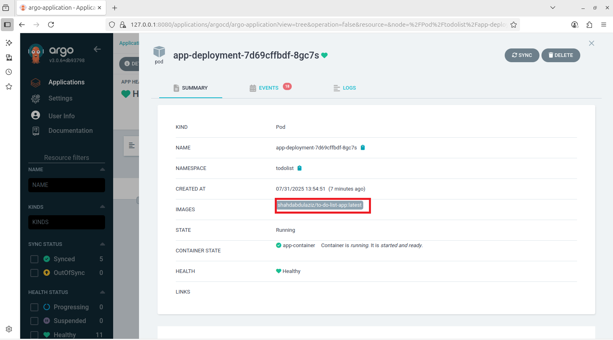
#### Apply a Change 
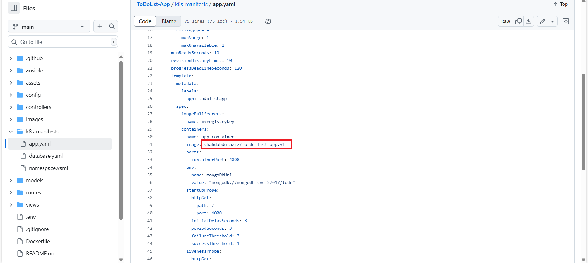
#### ArgoCD Pulls The New Image:
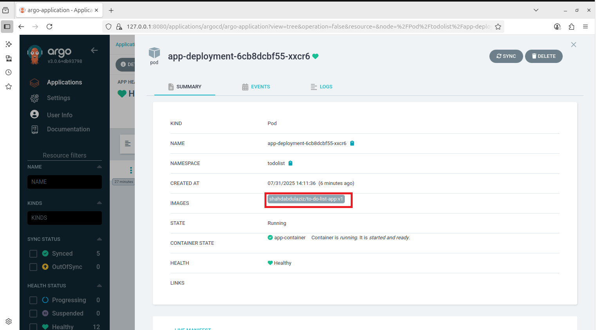


    - Referenced the secret in the pod spec via:
```yaml
imagePullSecrets:
  - name: myregistrykey
```
#### Application Screenshots
Below are some screenshots of the To Do List app running successfully after deployment:
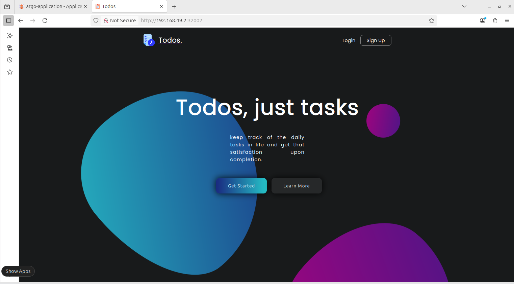
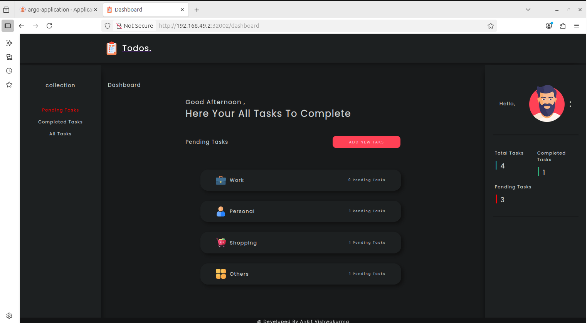
## Conclusion
This project demonstrates the full DevOps lifecycle from containerizing a Node.js application to automating its deployment using Kubernetes and GitOps practices with ArgoCD. By leveraging tools like Docker, GitHub Actions, Ansible, and Kubernetes, the solution ensures a scalable, automated, and production-ready deployment pipeline.
